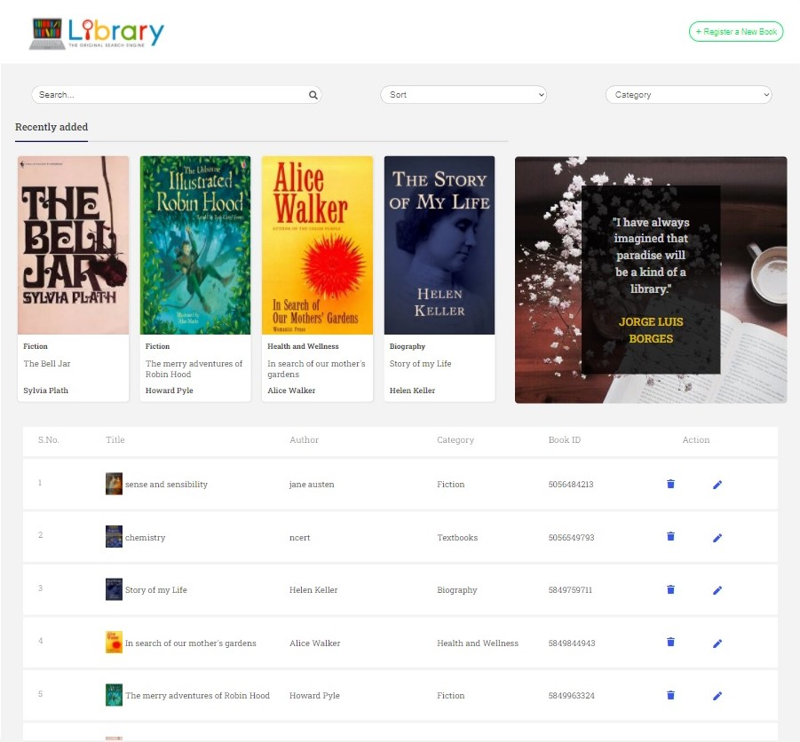

## Library Management system

This website allows users to perform CRUD operations with books' data,
i.e. new books can be registered, existing books' data can be updated and deleted.
Books can also be searched for (by book title), sorted (by author's name or book title),
and filtered according to their category.

### Links

- Live Site URL: [https://nikita-bhatnagar.github.io/Library-management-sysytem/](https://nikita-bhatnagar.github.io/Library-management-sysytem/)

### Built with

- HTML
- CSS
- Javascript
